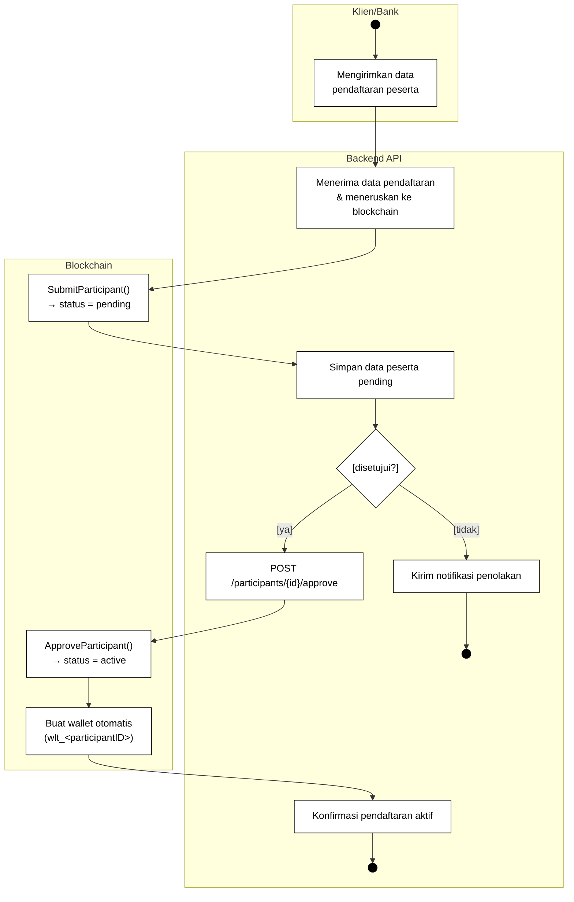
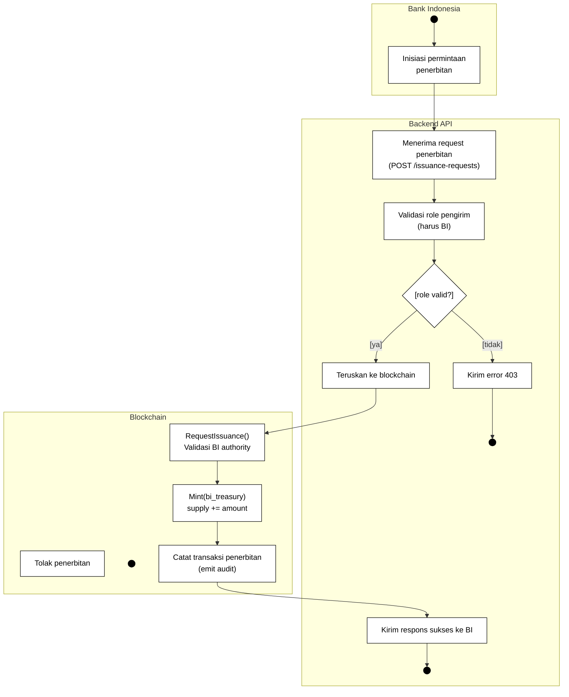
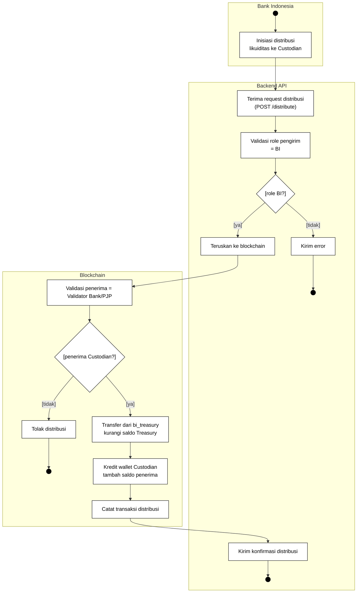
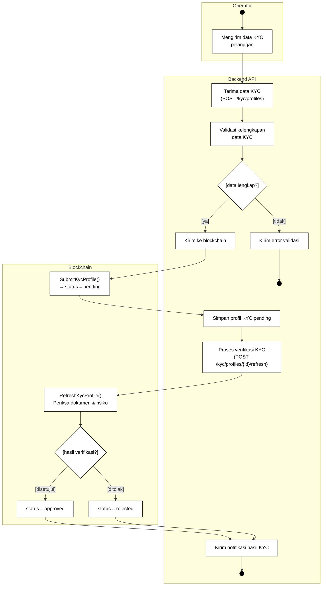
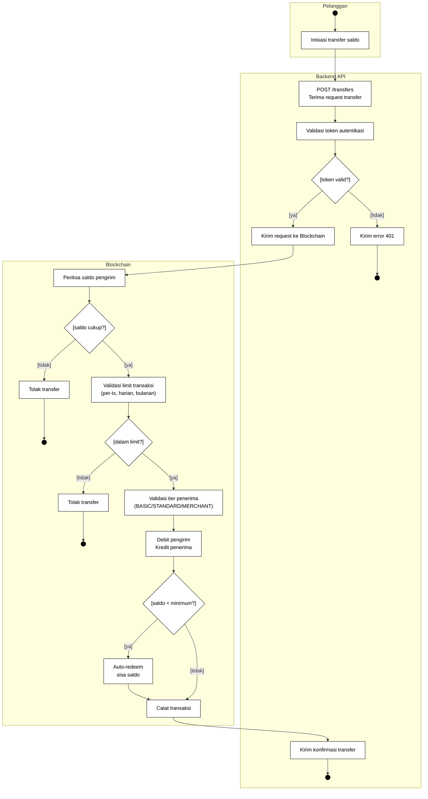
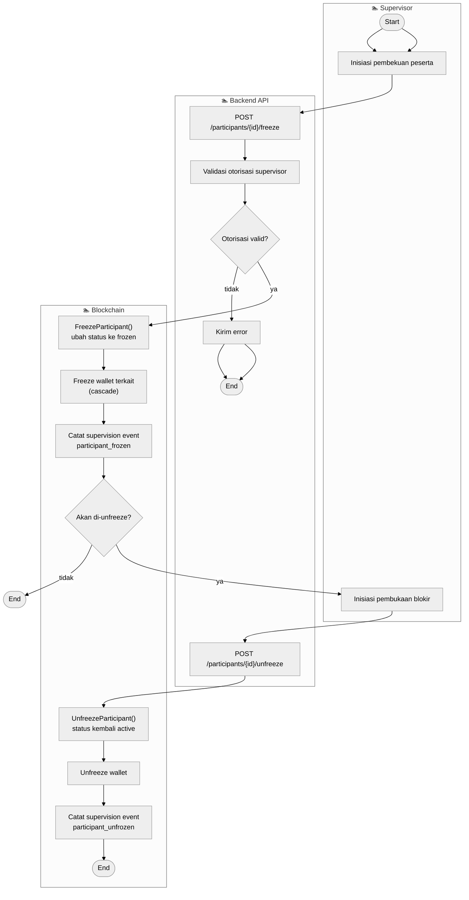
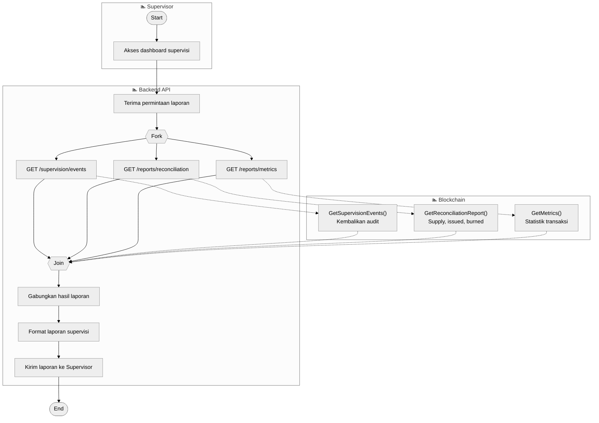

# Activity Diagrams Track A — CBDC Digital Rupiah (Hyperledger Fabric)

Mermaid flowchart diagrams for AD01–AD04 with monochrome styling.
Generated for Luthfi thesis format.

**Thesis scope:** KYC is implementation-only, and QRIS is code-only; both are
excluded from thesis acceptance criteria. Thesis acceptance criteria cover participant lifecycle,
treasury issuance, two-tier distribution, retail transfer, participant freeze,
and supervision.

---

## AD01 — Pendaftaran Peserta (Participant Registration)

---

## AD02 — Penerbitan Digital Rupiah (Digital Rupiah Issuance)

---

## AD03 — Distribusi Likuiditas dari Treasury (Treasury Liquidity Distribution)

---

## AD04 — Onboarding KYC Pelanggan (Customer KYC Onboarding)

# Activity Diagrams Track B — CBDC Digital Rupiah (Hyperledger Fabric)

Mermaid flowchart diagrams for AD05–AD07 with monochrome styling.
Generated for Luthfi thesis format.

---

## AD05 — Transfer Saldo Ritel (Retail Balance Transfer)

---

## AD08 — Pembekuan Peserta (Participant Freeze)

---

## AD10 — Laporan Supervisi (Supervision Reports)

