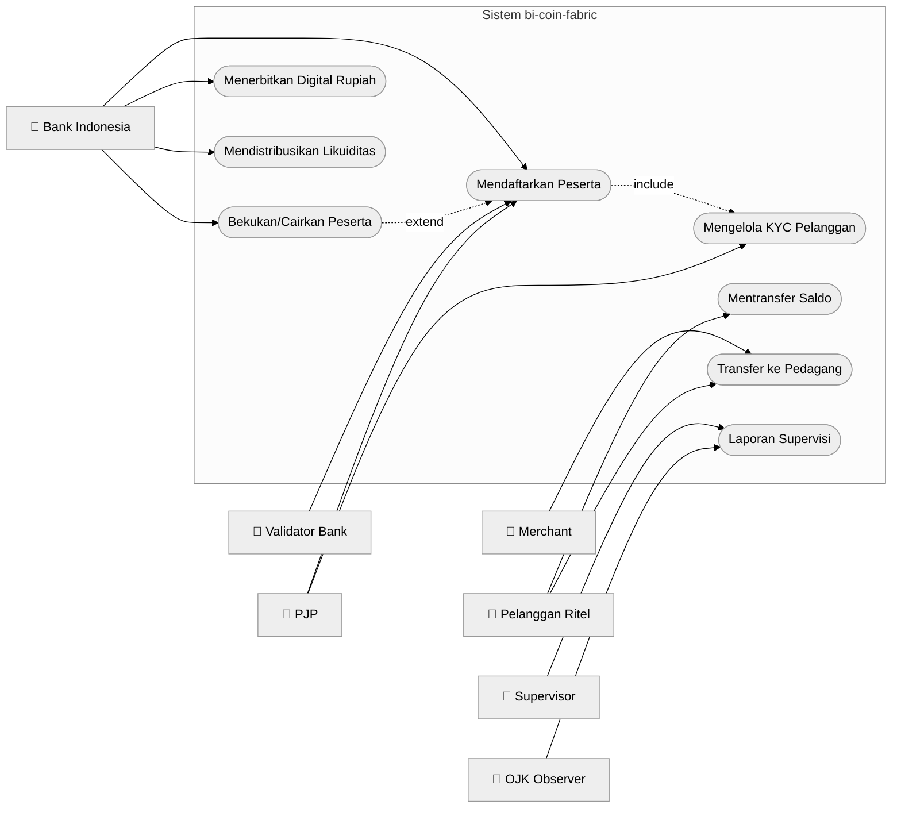
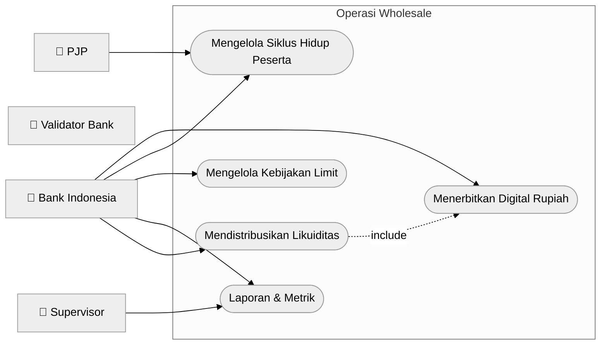
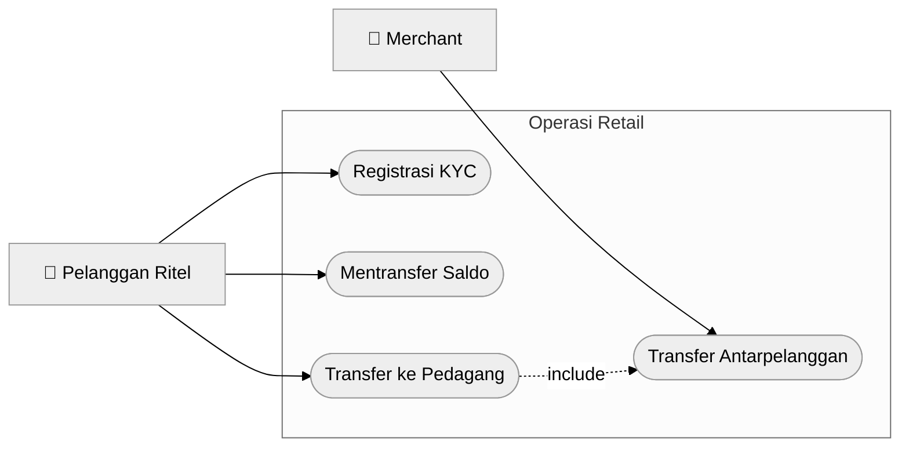

# Mermaid Use Case Diagrams — Track C

**Thesis scope:** KYC is implementation-only, and QRIS is code-only; both are
excluded from thesis acceptance criteria. Thesis acceptance criteria cover participant lifecycle,
treasury issuance, two-tier distribution, retail transfer, participant freeze,
and supervision.

## UC01 — Sistem Keseluruhan (Overall System)

---

## UC02 — Operasi Wholesale (Wholesale Operations)

---

## UC03 — Operasi Retail (Retail Operations)

